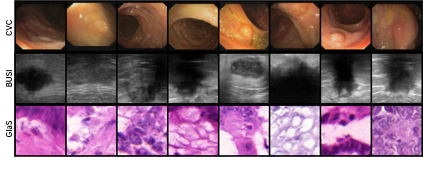

# Diffusion UKAN (arxiv)

> [**U-KAN Makes Strong Backbone for Medical Image Segmentation and Generation**](https://arxiv.org/abs/2406.02918)<br>
> [Chenxin Li](https://xggnet.github.io/)\*, [Xinyu Liu](https://xinyuliu-jeffrey.github.io/)\*, [Wuyang Li](https://wymancv.github.io/wuyang.github.io/)\*, [Cheng Wang](https://scholar.google.com/citations?user=AM7gvyUAAAAJ&hl=en)\*, [Hengyu Liu](), [Yixuan Yuan](https://www.ee.cuhk.edu.hk/~yxyuan/people/people.htm)<sup>✉</sup><br>The Chinese Univerisity of Hong Kong

Contact: wuyangli@cuhk.edu.hk

## 💡 Environment 
You can change the torch and Cuda versions to satisfy your device.
```bash
conda create --name UKAN python=3.10
conda activate UKAN
conda install cudatoolkit=11.3
pip install -r requirement.txt
```

## 🖼️ Gallery of Diffusion UKAN 



## 📚 Prepare datasets
Download the pre-processed dataset from [Onedrive](https://gocuhk-my.sharepoint.com/:u:/g/personal/wuyangli_cuhk_edu_hk/ESqX-V_eLSBEuaJXAzf64JMB16xF9kz3661pJSwQ-hOspg?e=XdABCH) and unzip it into the project folder. The data is pre-processed by the scripts in [tools](./tools).
```
Diffusion_UKAN
|    data
|    └─ cvc
|        └─ images_64
|    └─ busi
|        └─ images_64
|    └─ glas
|        └─ images_64
```
## 📦 Prepare pre-trained models

Download released_models from [Onedrive](https://gocuhk-my.sharepoint.com/:u:/g/personal/wuyangli_cuhk_edu_hk/EUVSH8QFUmpJlxyoEj8Pr2IB8PzGbVJg53rc6GcqxGgLDg?e=a4glNt) and unzip it in the project folder.
```
Diffusion_UKAN
|    released_models
|    └─ ukan_cvc
|        └─ FinalCheck   # generated toy images (see next section)
|        └─ Gens         # the generated images used for evaluation in our paper
|        └─ Tmp          # saved generated images during model training with a 50-epoch interval
|        └─ Weights      # The final checkpoint
|        └─ FID.txt      # raw evaluation data 
|        └─ IS.txt       # raw evaluation data  
|    └─ ukan_busi
|    └─ ukan_glas
```
## 🧸 Toy example
Images will be generated in `released_models/ukan_cvc/FinalCheck` by running this:

```python
python Main_Test.py
```
## 🔥 Training
<!-- You may need to modify the dirs slightly. -->
Please refer to the [training_scripts](./training_scripts) folder. Besides, you can play with different network variations by modifying `MODEL` according to the following dictionary,

```python
model_dict = {
    'UNet': UNet,
    'UNet_ConvKan': UNet_ConvKan,
    'UMLP': UMLP,
    'UKan_Hybrid': UKan_Hybrid,
    'UNet_Baseline': UNet_Baseline,
}
```


## 🤞 Acknowledgement 
Thanks for 
We mainly appreciate these excellent projects
- [Simple DDPM](https://github.com/zoubohao/DenoisingDiffusionProbabilityModel-ddpm-) 
- [Kolmogorov-Arnold Network](https://github.com/mintisan/awesome-kan) 
- [Efficient Kolmogorov-Arnold Network](https://github.com/Blealtan/efficient-kan.git)


## 📜Citation
If you find this work helpful for your project, please consider citing the following paper:
```
@article{li2024ukan,
  title={U-KAN Makes Strong Backbone for Medical Image Segmentation and Generation},
  author={Li, Chenxin and Liu, Xinyu and Li, Wuyang and Wang, Cheng and Liu, Hengyu and Yuan, Yixuan},
  journal={arXiv preprint arXiv:2406.02918},
  year={2024}
}
```

